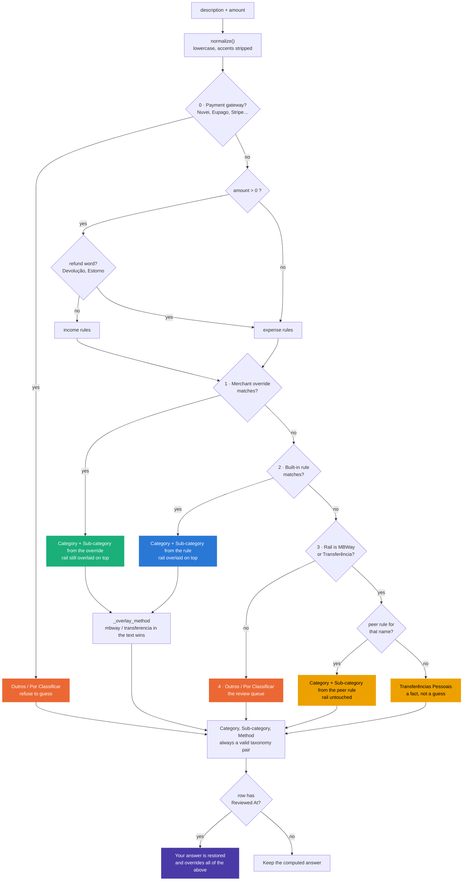

# The categorization intelligence

How a bank description becomes a Category, a Sub-category and a Method — what the system
guarantees, and where it can still be wrong.

## The taxonomy is declared first

`finance_tracker/taxonomy.py` lists **every Category / Sub-category pair the store may contain**.
It is data, not logic: no imports, no computation. Everything else in the system is a *writer* that
gets validated against it.

| Writer | Validated by | When |
|---|---|---|
| The built-in rule tables | `categorize._validate_rules()` | At import — a bad pair is an ImportError |
| User overrides | `overrides.add_override()` | Before the rule is saved |
| The dashboard's review panel | `assertValidPair()` + per-category `<select>` | Before Save writes anything |
| The dashboard's manual-entry form | per-category `<select>` | Before the row is added |
| Saved review decisions | `reviews.apply_reviews()` / `applyReviewsToStore()` | Every time one is re-applied |
| The Excel seeder | `taxonomy.resolve()` + `_resolve_method()` | On import |
| The existing store | `scripts/recategorize.py` | Whenever the taxonomy or the rules change |

The list is exhaustive on purpose: **a taxonomy is only as strict as its leakiest writer**, and the
last two rows were found by auditing for exactly that. Saved review decisions outlive the taxonomy —
a decision made when the gym lived under `Saúde` still says so — and re-applying one verbatim wrote
a retired pair straight back in, months later, silently. They now go through the same alias table as
everything else; a decision that cannot be placed keeps its note and timestamp (that is the research
someone actually did) and loses only its category.

This inversion is the point. The taxonomy used to be a list of category *names* in `schema.py` that
nothing enforced, so every writer could invent its own vocabulary — and did. The store ended up
holding `Gasoleo` next to `Combustível`, `Telemovel` next to `Telecomunicações`, `PPR` next to
`PPR/Fundo de Pensões`, `SuperMercado` filed under `Lazer`, and 71 sub-categories that were just
people's names. Each of those splits one real spending line into two chart bars that never add up,
and each looks completely plausible on its own.

The dashboard's Data health panel now checks the whole **pair**, not just the category name, so a
row that drifts back out of the taxonomy is visible rather than quietly averaged in.

### The shape of it

9 expense categories, 6 income categories, 55 valid pairs. Every category ends in a catch-all
`Outros` so that "I know it was health, I don't know which kind" has an honest home — with two
deliberate exceptions:

- **`Outros`** (expense) has no `Outros` sub-category. Its members are `Por Classificar` (the
  review queue), `Levantamento` (cash out, purpose genuinely unknown) and `Transferências Pessoais`
  (money to a named person for an unknown reason). The last two are *facts*, not unknowns — they
  are settled answers that simply aren't spending categories, and counting them as backlog would
  make the queue look permanently unfixable.
- **`Investimentos`** is money moving pocket-to-pocket, not spending. `SAVINGS_CATEGORY` keeps it
  out of every expense total, the same way the original Excel tracker did.

## Two questions, never mixed

A bank description answers two different questions, and the design rests on keeping them apart:

| Question | Answered by | Example signal |
|---|---|---|
| **What was this for?** | Category / Sub-category | `continente`, `cinema`, `ginasio` |
| **How did the money move?** | Method (the rail) | `mbway`, `transferencia` |

They are computed by separate machinery. Purpose comes from the rule tables; the rail comes from
`_overlay_method()`, which looks only for rail words and ignores everything else.

This matters because **both signals routinely appear in the same string**. `Mbway - Cinemas` names
a rail *and* a purpose. An earlier version treated MBWay as a Category, so the rail always won and
swallowed the purpose — every MBWay-paid cinema ticket landed in a generic transfer bucket even
though the description said "Cinemas".

### The guarantee this gives you

> **The payment rail can never change the Category or Sub-category.**

The fourth element of every rule — `"Cartão"`, `"Débito Direto"` — is **only a default for when the
description names no rail at all**. It is never a claim about how the money actually moved.

```
Ginasio Solinca          →  Desporto / Ginásio / Cartão
Mbway - Ginasio Solinca  →  Desporto / Ginásio / MBWay
Trf. MB WAY para Bhout   →  Desporto / Ginásio / MBWay
```

**So never write one rule per payment method.** Two rules with identical patterns differing only in
that default is not a safety net: rules are first-match-wins, so the second copy is *unreachable
code*. The protection comes from `_overlay_method()`, and it already applies to every rule.

## Refunds are negative spending, not income

A shop refund is a purchase being undone. Filed by its sign it became income
(`Reembolsos / Estornos`), and that was wrong twice over: return a €60 jacket and the month
showed €60 more earned *and* €60 still spent on clothes. Net was right; income, spending, the
savings rate and the health meters were all overstated.

So money in whose description carries a refund word (`REFUND_PATTERNS` in `categorize.py`:
`devolução`, `estorno` and plurals) goes down the **expense** side of the ladder, and is stored
as an `Expense` with a **negative** amount under the purchase's pair:

```
Devolucao Zara Porto   +59.99  →  Expense / Lazer / Roupa / −59.99
Estorno Loja Estranha   +5.00  →  Expense / Outros / Por Classificar / −5.00   (review queue)
Reembolso IRS 2025    +300.00  →  Income / Reembolsos / IRS                    (not a purchase)
```

Every total then nets with no special case, in both engines. A refund whose description names
nothing the rules know lands in the review queue, where you say what was bought. The review
panel can also mark any incoming payment as a refund, or un-mark one; that choice is saved in
`review_decisions.json` as `"refund": true` and survives a rebuild. A decision without the flag
was made on a row filed by its sign, so it puts the row back there: a refund you reviewed as
income before this existed stays income.

Refunds are left out of recurring commitments, sub-category medians and the biggest-spends
list, since they are not charges. `scripts/recategorize.py` converts unreviewed refunds still
stored as income; reviewed ones are left alone.

## Normalization: why patterns carry no accents

Every description goes through `normalize()` before matching — Unicode NFD, combining marks
dropped, lowercased, whitespace collapsed. `Refeição` and `Refeicao` are the same string by the
time a pattern sees them, so each pattern is written unaccented **once** instead of twice.

That is convenience. The real reason is cross-engine agreement. JavaScript's `\b` is defined over
`[A-Za-z0-9_]` only, while Python's is Unicode-aware, so `\bcafé\b` matched in the CLI and silently
did not in the browser — quietly breaking every accented keyword in the dashboard, including the
`transferência` rail detection. With accents stripped, an **ASCII-only boundary class is both safe
and identical on both sides**.

Which is why patterns are restricted to ASCII-safe regex syntax:

> **No `\b`, no `\w`, no `\p{...}`.** Those are exactly the constructs whose meaning differs
> between the engines. Word boundaries are applied for you by `_compile()`. Use `[a-z0-9]*` when
> you need to absorb truncation.

Truncation is a real constraint, not a hypothetical: the bank cuts descriptions at ~20 characters,
so ten rows read only `Carregamentos Vodafo`. A whole-word `vodafone` can never reach them, which
is why the rule says `vodaf[a-z]*`.

## The ladder



Read top to bottom: **the more specific and more human a piece of knowledge is, the later it gets
to speak and the harder it is to overrule.**

### Why each rung is where it is

**Before any rung: refunds pick the side.** A refund word on incoming money sends the row down
the expense rungs instead of the income ones (see "Refunds are negative spending" above). It
decides nothing else: overrides, rules and the fallback still answer what was bought.

**0 · Payment gateways go first, and refuse to answer.** `Nuvei Limited`, `Pagamento Eupago
Instituicao Pagamento Lda`, `Easypay`, `Safecharge`, `Stripe` and `Payshop` are processors that
resell other merchants: the description names the plumbing, never what was bought. There is no
honest category for one, so they short-circuit to the review queue rather than being matched
against merchant patterns that might accidentally fire. 18 rows in this store are gateway rows.

*Deliberately absent from that list:* SumUp and IfThenPay. Their descriptions carry the real
merchant after the prefix (`Sumup *lovecraft`), so an override on that merchant has to be able to
work.

**1 · Merchant overrides.** A correction you made to something the rules got wrong or had never
seen. A correction that loses to the thing it's correcting is not a correction. They set category
and sub-category outright — but never the Method, which was a real bug: an override taught from a
card payment used to stamp `Cartão` onto every later MBWay payment to the same merchant.

**2 · Built-in rules.** 34 expense rules, 7 income rules. General knowledge with no opinion about
your particular life.

**3 · Peer rules are deliberately last, and only in the fallback path.** A peer rule says "money to
or from this named person is usually X" — a much weaker claim than a merchant rule, since the same
friend can send rent one month and a birthday gift the next. Putting them after the purpose rules
means a real purpose signal always wins: `Mbway - Cinemas` stays Lazer/Cinema even if that
counterparty has a peer rule. They never set the Method, because the rail is an observed fact and a
name is not evidence about it.

**4 · The fallback is honest rather than clever.** A transfer with a named counterparty becomes
`Transferências Pessoais` — the counterparty's name is **not** used as the sub-category. That was
the old behaviour and it is what produced 71 name-shaped sub-categories; the name is in `Notes`,
where the review queue still shows it, and the income breakdown stops being a phone book.

**Above all of it: your review.** A row with `Reviewed At` is settled. `applyOverridesToStore()`
skips it, `apply_reviews()` restores it, `recategorize.py` never re-derives it, and no rule can
touch it. Human judgement is the top of the ladder, not an input to it.

## Matching semantics

**Whole-word matching.** `_compile()` wraps every rule in `(?<![a-z0-9_])(?:…)(?![a-z0-9_])`, so
`ppr` doesn't match inside `Petfiestas` and `cerveja` doesn't match inside `cervejaria` — which is
load-bearing, because in Portuguese a *cervejaria* is a restaurant while "cerveja" on its own is a
night out.

**First match wins, top to bottom.** A general pattern above a specific one makes the specific one
dead. This is load-bearing in four places, each commented in the table:

| This must come first | …or this breaks |
|---|---|
| `uber eats` (Take-away) | `uber` would file dinner as Transportes |
| `amazon prime` (Subscrições) | `amazon` would swallow it into Compras Online |
| `cinema` (Lazer) | `nos` (telecom) would claim `NOS Cinemas` |
| Nightlife before restaurants | every bar named `Café …` becomes a meal |

**Patterns are matched against the normalized description.** Written unaccented and lowercase; case
and accents in the tables would be dead weight that looks like a working rule.

**The suggested method is a default, not a promise.** Covered above.

## Known hazards

### Structural

**Local merchants are not the rule tables' job.** 117 expense rows (22.6%, €5,107) are still in the
review queue, and most are venues whose names carry no generic word: `Repertrio Diguarias`,
`Always Pleasant Lda`, `Nortada`, `O Polar Cam. Lobos`, `Caldeirao Dinamico`. No universal keyword
reaches them and inventing one would be guessing. They belong in `category_overrides.json`, taught
once from the review panel — see [knowledge-placement.md](knowledge-placement.md).

**Descriptions are truncated.** 50 rows are exactly 20 characters, 13 are 21, 31 are 22. Whole-word
matching cannot reach a word that was chopped. When a merchant keeps landing in the queue despite a
rule that looks right, check the length of the description first, then reach for `[a-z0-9]*`.

**Short and common tokens are loaded guns.** `nos`, `tap`, `bp`, `max`, `rest` currently behave, but
`nos` is an ordinary Portuguese word and `tap` an ordinary English one. They will eventually fire on
something unrelated, and the result will look plausible.

**`allianz` is narrowed to `allianz seguros` on purpose.** `S700 - Allianz Stadium` was being filed
as insurance.

**The codegen covers the tables, not the algorithm.** `rules.js` is generated, so the taxonomy and
patterns cannot drift — but `categorize()` itself is written twice, in Python and in `index.html`.
A change to the *logic* has to be made in both. Verify with a cross-engine run: categorize every
description in the store with both engines and compare. That is how normalization, the gateway rung
and the fallback rewrite were checked (705 cases, 0 disagreements).

## Adding a rule

```python
# finance_tracker/categorize.py — PURPOSE_EXPENSE_RULES
(["pattern", "another[a-z0-9]*"], "Category", "Sub-category", "Cartão"),
```

Then regenerate the dashboard's copy, or the two engines disagree:

```bash
python3 scripts/generate_dashboard_rules.py
```

Checklist before you add one:

- Is the pair **in the taxonomy**? If not, add it to `taxonomy.py` first — the import will fail
  otherwise, which is the intended outcome.
- Is it **general knowledge or personal knowledge**? See
  [knowledge-placement.md](knowledge-placement.md) — most of what you'll want to add belongs in the
  overrides file, not here.
- Is the pattern **ASCII-safe** — no `\b`, `\w` or `\p{...}`, and written unaccented?
- Could it appear inside an unrelated merchant name? Prefer the longest distinctive fragment.
- Will the bank's truncation reach it? Check a real description's length.
- Does an earlier rule already claim it? First match wins.
- Tempted to write a second copy for a different payment method? Don't.

## Changing the taxonomy

Adding a sub-category is cheap: add it to the tuple in `taxonomy.py`, re-run the codegen. Renaming
or removing one is not — the store already holds rows using the old name, so it needs an entry in
`LEGACY_ALIASES`, which is what lets old data keep working and what `scripts/recategorize.py` reads.

```bash
python3 scripts/recategorize.py            # dry run: what would move where
python3 scripts/recategorize.py --apply    # backs the store up first
```

`recategorize.py` is the only thing that rewrites categories in bulk, and its restraint is the
point. It normalizes off-taxonomy pairs, then re-runs the rules over rows still awaiting an answer,
and it will not:

- **touch a row with `Reviewed At`** — normalized through the alias table, never re-derived;
- **demote** — if today's rules can't beat the review bucket for a row that already has a real
  category, the real category stays;
- **change a category** — it *will* refine a row sitting on a catch-all `Outros` sub-category when
  the rules can now name a specific one, but only within the same category.

That last rule is what makes the catch-alls worth having. `Desporto/Outros` is an honest answer
today and becomes `Desporto/Corrida` the moment a rule can read "São Silvestre" — without a human
having to revisit it, and without a regex ever being allowed to overrule the category a human chose.

## Auditing what the rules decided

An unchecked auto-classification and a hand-reviewed one look identical in the store: same columns,
same charts. The difference is only in `Reviewed At`, and that is exactly the difference you want
when you've just written a rule and want to know what it did.

The dashboard's Transactions table filters on it directly — **Review state → "Auto-classified,
unchecked"**, narrowed to a category and sub-category. From the CLI:

```python
from finance_tracker import pipeline, schema
df = pipeline.load_store("data/transactions.csv")
unchecked = df[(df[schema.REVIEWED_AT].astype(str).str.strip().isin(["", "nan"]))
               & (df[schema.SUBCATEGORY] == "Take-away/Delivery")]
```
