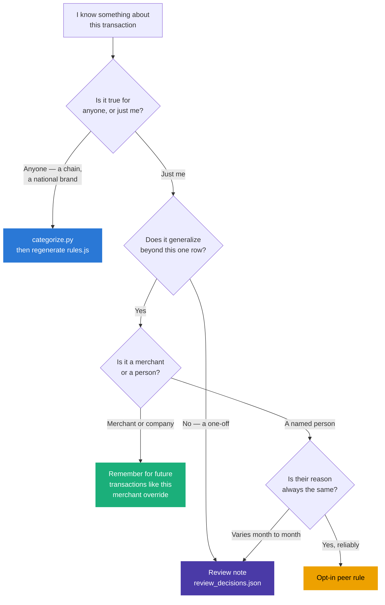

# Where knowledge lives, and why it's split up

> *"Why are some rules hard-coded in `PURPOSE_EXPENSE_RULES` and other knowledge stored
> elsewhere?"*

A fair question, because from inside the review panel the two feel identical: you know a thing
about a merchant, you record it, matching transactions get categorized. The split is real, but the
line is not where the file extension suggests.

## The four places

| Where | Holds | Written by | Scope | In git |
|---|---|---|---|---|
| `taxonomy.py` | The strict Category/Sub-category vocabulary | You, editing code | Every user of this pipeline | Yes |
| `categorize.py` | Built-in regex rules | You, editing code | Every user of this pipeline | Yes |
| `category_overrides.json` (merchant) | "This merchant means X" | The dashboard, on a checkbox | Every matching description, forever | Yes |
| `category_overrides.json` (peer) | "This person usually means X" | The dashboard, opt-in | Transfers naming that person | Yes |
| `review_decisions.json` | "This exact transaction was X" | The dashboard, on save | One transaction id | No |

## The distinction that actually holds

Not code-vs-data. **Universal-vs-personal.**

- **`categorize.py` is for knowledge true for anyone.** Continente is a supermarket. Galp sells
  fuel. Netflix is a subscription. Nothing about those facts depends on whose account it is. They
  belong in version control, get reviewed as a diff, and ship to both the Python and JavaScript
  engines through the generator.

- **The JSON files are for knowledge true for *you*.** Your gym. Your friends. The bar you go to.
  The answer you worked out for one specific €38 payment. These change without a code edit, live
  on your machine, and frequently contain people's names.

Everything else follows from that one distinction. Universal knowledge is stable, shareable and
worth the ceremony of a code change plus regeneration. Personal knowledge changes constantly, is
generated by clicking rather than editing, and shouldn't require a developer workflow — and by the
time you're recording a fact about one transaction, generalizing it at all would be wrong.

The three JSON layers then split by **how far the knowledge generalizes**, which is also exactly
their order of authority in the ladder:

```
one transaction  <  one person  <  one merchant  <  everyone
review_decisions    peer rule       merchant rule    categorize.py
```

All four are bounded by the same ceiling: **none of them may name a Category/Sub-category pair that
isn't in `taxonomy.py`.** Personal knowledge decides *which* bucket a transaction lands in; it does
not get to invent a bucket. `overrides.add_override()` and the dashboard's review panel both refuse
off-taxonomy pairs — which is the difference between correcting a miscategorization and creating a
second one that no chart adds up.

## Where the seam used to leak

This split was worth stating because the code table had drifted across it. Sitting in
`PURPOSE_EXPENSE_RULES` were `feirense`, `ericeira`, and eleven named Porto venues
(`tiki taka`, `mau maria`, `plano b`, `castle cocktail`, …). None are universal facts — they're
*your* gym and *your* nights out — and they carried three real costs:

1. **`categorize.py` is committed and pushed to your GitHub remote.** A list of your gym and eleven
   bars you frequent is a small but genuine personal-location leak, in a file whose whole purpose
   is to be impersonal.
2. **Every change needed the codegen step.** Add a venue to the code table and the dashboard keeps
   the old rules until you run `generate_dashboard_rules.py`. An override applies immediately, in
   both engines, with no build step.
3. **Overrides reach rows you already have.** The dashboard re-runs the categorizer over fallback
   rows on load, so a new override fixes the backlog too; a new code keyword only affects future
   imports until you run `scripts/recategorize.py`.

Those keywords now live in `data/category_overrides.json`, and the code table keeps the general
form instead — `discoteca`, `pub`, `bar`, `nightclub`, `cocktail` — which is knowledge that works
for anyone. Same behaviour for you, less of your life in git.

**Kept in the code table on purpose:** `bhout` (a real gym chain), `hawkers` (a sunglasses brand),
`unilabs` (an international lab chain), `latam` (an airline). Those are brands, not local
knowledge, so they pass the universal test.

## Deciding where something goes



In practice, **most of what you'll want to add is a merchant override**, and the review panel is
the right place to add it. Reach for `categorize.py` when you're teaching the pipeline something
about the world rather than about your life.

## The Feirense case, worked through

`feirense` is the useful example, because it looks like a contradiction and isn't.

- Generally, an expense tagged `Feirense` is **your gym**. So `feirense → Desporto/Ginásio` is a
  correct, useful rule.
- Once, `Feirense - Lourosa` was a **match ticket**, which you filed by hand as `Desporto/Futebol`.

There is no rule that gets both right, and there shouldn't be — a keyword table describes the
usual case, and the exception is precisely what the review layer exists for. The ladder handles it
exactly as designed:

1. The rule categorizes every Feirense charge as `Desporto/Ginásio`.
2. You open the one match-ticket row and set it to `Desporto/Futebol`, with a note saying why.
3. That row now carries `Reviewed At`, so **no rule will ever overwrite it again** — not on
   re-import, not after a `reset_store.py` rebuild, not when you next edit the keyword tables.

The general rule stays general; the exception stays an exception; neither has to be weakened to
accommodate the other. That's the layering doing its job.

By the universal-vs-personal test `feirense` is personal knowledge, so it now lives in
`data/category_overrides.json` rather than the shared code table. Identical behaviour, and it no
longer travels to GitHub with the rest of the pipeline.

## Moving knowledge between layers

Nothing is stuck where it started:

- **Code table → override:** delete the keyword from `categorize.py`, regenerate, then teach it
  once from the review panel.
- **Override → code table:** move the keyword into a rule and drop the entry from
  `category_overrides.json`. Worth doing if a merchant turns out to be genuinely universal.
- **Review → override:** re-open the transaction and tick "Remember for future transactions like
  this".
- **Override → nothing:** delete the entry. Rows it already changed keep their categories; only
  future matching stops.
