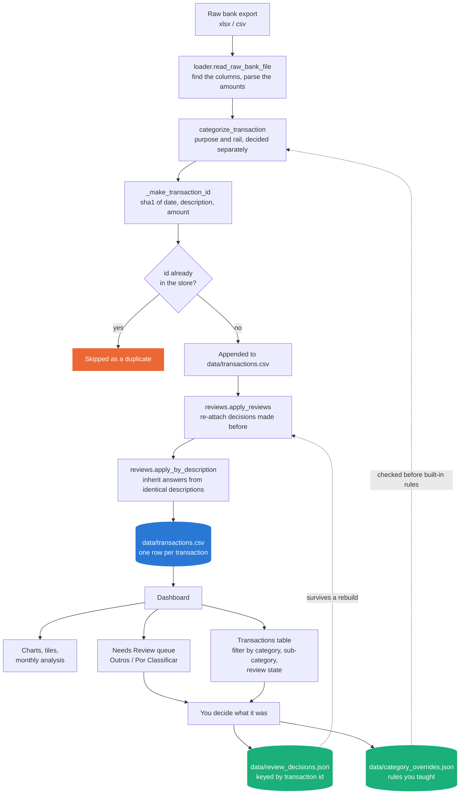
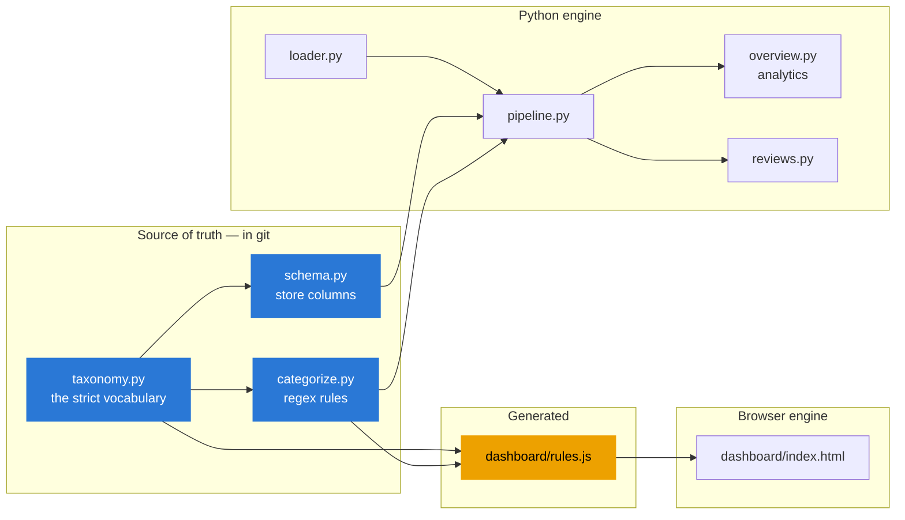

# Pipeline overview

What happens to a transaction between leaving your bank and appearing in a chart.

## The whole process



The two dotted arrows are the point of the whole design: **work you do in the review panel flows
back into the pipeline**, so the next import is smarter than the last one, and rebuilding the
store from raw files doesn't throw your decisions away.

## Why the id is a hash of the transaction

`transaction_id = sha1(date | description | amount)[:16]`, computed identically in
`finance_tracker/pipeline.py` and in the dashboard's JavaScript.

Deriving the id from the transaction itself — rather than a row number, an import timestamp, or a
UUID — buys four things at once:

- **Re-importing a file is a no-op.** Every row hashes the same the second time.
- **Overlapping files de-duplicate themselves.** A card export and an account export covering the
  same purchase collapse to one row, with no cross-file logic anywhere.
- **Either tool can go first.** The CLI and the browser produce the same ids, so ingesting in one
  and then the other is safe.
- **Decisions survive a rebuild.** `reset_store.py` → re-ingest reproduces the same ids, so
  `review_decisions.json` can re-attach every answer to the right row.

The cost, stated plainly: two genuinely distinct transactions with the same date, description and
amount — two identical €5 coffees on one day — hash identically, and the second is treated as a
duplicate. That trade was taken deliberately; the alternative is duplicates you have to notice by
hand every month.

## What each file is responsible for



There are **two categorization engines** — Python for the CLI and notebook, JavaScript so the
dashboard works offline and client-side. They must agree, or the same file categorizes differently
depending on which tool you fed it to.

They used to be kept in step by hand, and they drifted: by the time this was noticed the tables
were **21 keywords apart**, with `Saídas Noite` and `Laboratório` existing only on the Python side.
Both answers looked correct in isolation, which is what makes that class of bug expensive. So
`dashboard/rules.js` is now generated:

```bash
python3 scripts/generate_dashboard_rules.py          # after editing any rule
python3 scripts/generate_dashboard_rules.py --check  # what the pre-commit hook runs
```

The pre-commit hook refuses a commit that touches `categorize.py` or `schema.py` while leaving
`rules.js` stale, so the drift cannot silently come back.

What crosses into the browser is the **taxonomy itself**, the `LEGACY_ALIASES` table, plus the rule
patterns as strings — the
dashboard compiles them with the same word-boundary wrapper Python uses. That is why patterns are
restricted to ASCII-safe regex syntax (no `\b`, `\w` or `\p{...}`): those three are precisely the
constructs whose meaning differs between the two engines. See
[categorization.md](categorization.md).

The alias table crosses too because the browser re-applies saved review decisions on load, and it
has to resolve a legacy pair to the *same* place Python would. Validating on one side and aliasing
on the other would be a fresh divergence of exactly the kind `rules.js` exists to prevent.

## Reading the export

`loader.read_raw_bank_file` does two jobs, and the second is less obvious than it looks.

**Finding the columns.** Bank exports disagree on header names — `Montante( EUR )` vs
`Montante(EUR)` vs `Montante` — so each logical field has a list of aliases.

**Parsing the amounts.** A Portuguese bank writes `1.424,00`: dot for thousands, comma for
decimals. An English one writes `1,424.00`. The parser works the convention out per value — whichever
separator appears *last* is the decimal point — rather than assuming one. It also handles a trailing
minus (`12,34-`, which some exports use for a debit) and numeric Excel cells, which need nothing.

This is not hypothetical tidiness. The previous implementation replaced every comma with a dot, so
`1.424,00` became `1.424.00` and `float()` rejected it: **a single transaction over €999 in a CSV
export aborted the whole ingest**, with an error that named neither the file nor the row. Rows with
an unreadable date or amount are now skipped and *counted out loud*, and a file where nothing parses
raises rather than silently returning an empty frame.

## The store

One CSV, one row per transaction, income and expense together with a `Type` column:

```
transaction_id, Date, Type, Category, Sub-category, Method, Amount (€),
Notes, Review Note, Reviewed At, Month, Year, Source File
```

- `Notes` is the original bank description, never rewritten. Everything else is interpretation
  layered on top of it, which is why re-deriving the interpretation is always possible.
- `Reviewed At` doubles as a flag: a row that has it carries a human answer, and **no keyword rule
  or override will ever overwrite it**.
- `Review Note` is what you worked out about the transaction. It's the part that used to be lost.

Three companion files sit next to it, and they are not interchangeable:

| File | Holds | In git? |
|---|---|---|
| `data/transactions.csv` | Everything | **Never** — only `transactions.csv.enc` |
| `data/category_overrides.json` | Rules you taught, keyed by keyword | Yes |
| `data/review_decisions.json` | Answers you gave, keyed by transaction id | No — contains your notes |

## Where analysis happens

`overview.py` and the dashboard's Monthly analysis card compute the same things, and both treat
**transfers into savings as not-spending** — that money moved, it wasn't spent, and counting it
makes every month you invested look like a blowout. Trailing averages exclude the month being
judged, since a month compared against an average it belongs to always looks closer to normal than
it is.

## Keeping the store in step

Categorization happens once, at ingest — so a rule you write today reaches next month's import and
nothing already in the store. `scripts/recategorize.py` closes that gap, and is the only script
that rewrites categories in bulk:

```bash
python3 scripts/recategorize.py            # dry run
python3 scripts/recategorize.py --apply    # backs the store up first
```

Two passes: **normalize** (map any pair that has fallen outside the taxonomy through
`LEGACY_ALIASES` — also how a rename is carried out) then **re-classify** (run today's rules over
rows still awaiting an answer). Three things it will not do, each of them load-bearing:

- **Touch a reviewed row.** Normalized through the alias table, never re-derived.
- **Demote.** If today's rules can't beat the review bucket for a row that already has a real
  category, the real category stays. This fills blanks; it doesn't overwrite answers with shrugs.
- **Change a category.** It *will* refine a row sitting on a catch-all `Outros` sub-category when
  the rules can name a specific one — but only within the same category. A regex may sharpen a
  human's judgement, never replace it.

See [categorization.md](categorization.md) for how the category itself is decided, and
[knowledge-placement.md](knowledge-placement.md) for where to add what you know.
